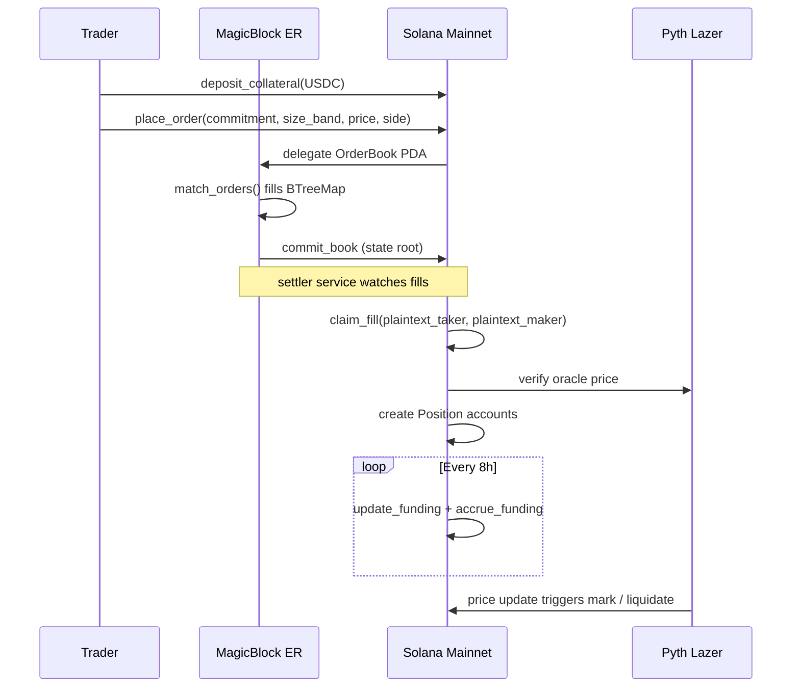

# DarkBook

**The dark pool Hyperliquid can't copy. Sub-50ms private matching on Solana.**

> The invention: **Dark Commit** the deferred-reveal invariant every confidential order must satisfy.  
> `commitment = SHA-256(salt ‖ size ‖ leverage ‖ trader)` published at place; plaintext revealed only at settlement, atomically verified on-chain.


---

## What it is

DarkBook is a confidential central limit order book (CLOB) for perpetual futures on Solana. Orders are matched in a MagicBlock Ephemeral Rollup at sub-50ms latency. Order size and identity are hidden using the **Dark Commit** scheme a cryptographic commitment that binds traders to size + leverage + identity without revealing them until settlement. No ZK circuits, no centralized sequencer, no MEV exposure. Settlement is atomic on Solana mainnet via Jito bundles. PnL is public; order details are not.

This is the institutional-perps thesis on Solana: traders who refuse to broadcast position size to a public mempool now have a venue that matches Hyperliquid speed without the centralization tradeoff.

- Demo: [https://github.com/aarav1656/darkbook](https://github.com/aarav1656/darkbook) (Loom recording, devnet dashboard, and program ID land here as deploy lands)
- Source: [https://github.com/aarav1656/darkbook](https://github.com/aarav1656/darkbook)
- Architecture: see [ARCHITECTURE.md](./ARCHITECTURE.md)
- Sponsor integrations: see [SIDETRACKS-CANONICAL.md](./SIDETRACKS-CANONICAL.md)

---

## Architecture

```
┌─────────────────────────────────────────────────────────────────┐
│  TRADER (Alice)                                                 │
│  Phantom wallet, USDC collateral deposited on mainnet           │
└────────────────────────┬────────────────────────────────────────┘
                         │ 1. place_order(side, price_ticks,
                         │    size_band, leverage_bps, commitment)
                         │    commitment = sha256(salt || size || lev || trader)
                         │    Public: side, price, size_band (Small/Med/Large/Whale)
                         │    Hidden: exact size, exact leverage, trader identity
                         ▼
┌─────────────────────────────────────────────────────────────────┐
│  MAGICBLOCK EPHEMERAL ROLLUP                                    │
│  Single Anchor program `darkbook`, OrderBook PDA delegated here │
│  Validator: devnet-us.magicblock.app (MAS1Dt9...)               │
│  ├── match_orders: BTreeMap bids/asks, price-time priority      │
│  ├── Produces Fill { taker, maker, price, size_band, slot }     │
│  └── commit_book: state root committed to Solana mainnet        │
│  Latency: <50ms matching window between ER finalities           │
└────────────────────────┬────────────────────────────────────────┘
                         │ 2. ER commits OrderBook state root
                         │    settler service watches ER for fills
                         ▼
┌─────────────────────────────────────────────────────────────────----┐
│  SOLANA MAINNET (Anchor settlement program)                         │
│  ├── claim_fill: verifier reveals plaintext (both sides),           │
│  │              checks sha256 == commitment, creates Position       │
│  ├── Position { side, size_lots, entry_price, collateral }          │
│  ├── mark_position: reads Pyth price feed, updates unrealized       │
│  ├── update_funding + accrue_funding: 8h funding accrual            │
│  ├── liquidate_position: (remaining_after_pnl / locked) × 10_000    │
│  │    falls below 8_000 bps (80% maintenance); else NotLiquidatable │
│  └── close_position: trader-initiated exit, PnL realized            │
└────────────────────────┬─────────────────────────────────────----───┘
                         │
┌────────────────────────▼────────────────────────────────────────┐
│  OFF-CHAIN SERVICES (TypeScript / Bun)                          │
│  ├── settler: watches ER fills, calls claim_fill on mainnet     │
│  ├── liquidation-watcher: Pyth Lazer → collateral_ratio check   │
│  ├── funding-cron: 8h periodic update_funding + accrue          │
│  └── er-broadcaster: mirrors order book state for dashboard     │
└─────────────────────────────────────────────────────────────────┘
```

### Privacy Model

ZK ElGamal is disabled on devnet. DarkBook uses a commitment scheme instead:

- Off-chain: trader encrypts `(size_lots, leverage_bps, salt)` with ECIES
- On-chain order stores: `commitment = sha256(salt || size_lots_le || leverage_bps_le || trader_pubkey)`
- Public on-chain: side (Long/Short), price_ticks, size_band (Small/Med/Large/Whale), market
- At settlement: settler reveals plaintext, contract verifies sha256 matches commitment
- Result: order books are fully visible to ER validators; order size is hidden from mempool observers and competing traders

### Mermaid (collapsible view)




---

## Quickstart

### Prerequisites

- Rust 1.78+ (`rustup default stable`)
- Solana CLI 1.18+ (`solana --version`)
- Anchor CLI 0.32.1 (`anchor --version`)
- Bun 1.1+ (`bun --version`)
- A Solana devnet wallet with SOL and USDC

### Install dependencies

```bash
git clone <github-repo-url>
cd darkbook
bun install
cd sdk && bun install && cd ..
cd dashboard && bun install && cd ..
```

### Build the Anchor program

```bash
anchor build
```

### Run tests (bankrun, no devnet required)

```bash
anchor test
```

### Deploy to devnet

```bash
cd scripts
bash deploy-devnet.sh
# Outputs deployed program ID — set DARKBOOK_PROGRAM_ID in .env
```

### Initialize a market (SOL/USDC)

```bash
bun run scripts/setup-market.ts \
  --asset SOL \
  --oracle 0xef0d8b6fda2ceba41da15d4095d1da392a0d2f8ed0c6c7bc0f4cfac8c280b56d \
  --max-leverage 1000 \
  --taker-fee 10 \
  --maker-rebate 3
```

### Run the dashboard (development)

```bash
cd dashboard
bun dev
# Open http://localhost:3000
```

### Run off-chain services

```bash
# Terminal 1: settler (watches ER fills, submits claim_fill)
cd services/settler && bun run index.ts

# Terminal 2: liquidation watcher
cd services/liquidation-watcher && bun run index.ts

# Terminal 3: ER broadcaster (mirrors order book for dashboard)
cd services/er-broadcaster && bun run index.ts

# Terminal 4: funding cron (8h period)
cd services/funding-cron && bun run index.ts
```

### Seed demo wallets (devnet)

```bash
bun run scripts/seed-demo.ts
# Creates Alice (short) + Bob (long) wallets, airdrops devnet SOL, places demo orders
```

---

## Tech Stack


| Layer            | Technology                                                            |
| ---------------- | --------------------------------------------------------------------- |
| Smart contract   | Anchor 0.32.1, Rust, single `darkbook` program                        |
| Ephemeral Rollup | MagicBlock BOLT SDK (`ephemeral-rollups-sdk 0.11.1`)                  |
| Oracle           | Pyth pull oracle (`pyth-solana-receiver-sdk 0.6.x`), Pyth Lazer WS    |
| Token standard   | SPL Token (plain), USDC collateral                                    |
| Order privacy    | ECIES off-chain encryption + sha256 commitment on-chain               |
| Settlement       | Jito bundles for atomic mainnet settlement                            |
| RPC              | Helius devnet (Geyser for position event streaming)                   |
| SDK              | Solana Web3.js v2, `@magicblock-labs/ephemeral-rollups-sdk`           |
| Frontend         | Next.js 16 App Router, shadcn/ui, TradingView Lightweight Charts      |
| Services         | TypeScript + Bun (settler, liq-watcher, funding-cron, er-broadcaster) |
| Testing          | bankrun (unit), Anchor tests on ER testnet (integration)              |


---

## Repo Layout

```
darkbook/
├── Anchor.toml
├── Cargo.toml
├── package.json
├── programs/darkbook/
│   └── src/
│       ├── lib.rs              # entrypoint, declare_id, mod re-exports
│       ├── state.rs            # account structs (Market, Position, OrderBook, Fill)
│       ├── errors.rs           # DarkbookError enum
│       ├── events.rs           # OrderPlaced, PositionOpened, Liquidated, etc.
│       ├── constants.rs        # PDA seeds, fee decimals
│       ├── matching_engine.rs  # pure BTreeMap matching logic
│       └── ix/
│           ├── admin.rs        # initialize_market, pause
│           ├── collateral.rs   # deposit_collateral, withdraw_collateral
│           ├── orders.rs       # place_order, cancel_order, delegate_book
│           ├── matching.rs     # match_orders (ER), commit_book, undelegate
│           ├── settlement.rs   # claim_fill
│           ├── positions.rs    # mark_position, liquidate_position, close_position
│           └── funding.rs      # update_funding, accrue_funding
├── sdk/                        # TypeScript DarkbookClient SDK
│   └── src/
│       ├── client.ts
│       ├── encryption.ts       # ECIES + commitment
│       ├── pyth.ts             # Lazer subscriber
│       ├── pdas.ts
│       └── types.ts
├── dashboard/                  # Next.js 16 app (Trade, Positions, History, Leaderboard)
├── services/
│   ├── settler/
│   ├── liquidation-watcher/
│   ├── funding-cron/
│   └── er-broadcaster/
├── tests/
│   ├── darkbook.ts             # bankrun unit tests
│   └── e2e-demo.ts             # end-to-end demo scenario
└── scripts/
    ├── deploy-devnet.sh
    ├── setup-market.ts
    └── seed-demo.ts
```

---

## Endpoints (devnet)


| Service                | URL                                                                  |
| ---------------------- | -------------------------------------------------------------------- |
| Solana devnet RPC      | `https://api.devnet.solana.com`                                      |
| MagicBlock ER (devnet) | `https://devnet-us.magicblock.app/`                                  |
| MagicBlock ER WS       | `wss://devnet-us.magicblock.app/`                                    |
| ER validator pubkey    | `MAS1Dt9qreoRMQ14YQuhg8UTZMMzDdKhmkZMECCzk57`                        |
| Pyth Lazer WS          | `wss://pyth-lazer.dourolabs.app/v1/stream`                           |
| SOL/USD feed ID        | `0xef0d8b6fda2ceba41da15d4095d1da392a0d2f8ed0c6c7bc0f4cfac8c280b56d` |


---

## License

MIT

---

## Acknowledgements

- **Anatoly Yakovenko** — Percolator (immutable risk engine, Feb 2026). DarkBook extends the Percolator pattern to a private order book context. Same operational-safety philosophy: immutable settlement contract, burned admin keys, permissionless liquidators.
- **MagicBlock team** — Ephemeral Rollups SDK + devnet infrastructure that makes sub-50ms on-chain matching possible without a separate chain.
- **Pyth Network** — Lazer sub-ms price feeds that eliminate oracle latency as a bottleneck for liquidation accuracy.
- **Galaxy Digital** — ICM thesis (Oct 2025) framing Solana's destiny as "Nasdaq at the speed of light." DarkBook is infrastructure for that future.

